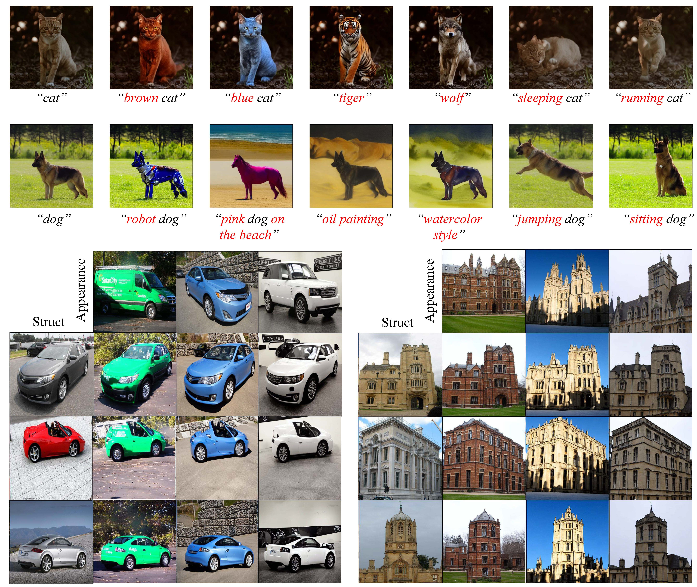

# TI-Guided-Edit
Officail Implementation for "Unified Diffusion-Based Rigid and Non-Rigid Editing with Text and Image Guidance"
> Existing text-to-image editing methods tend to excel either in rigid or non-rigid editing but encounter challenges when combining both, resulting in misaligned outputs with the provided text prompts. In addition, integrating reference images for control remains challenging. To address these issues, we present a versatile image editing framework capable of executing both rigid and non-rigid edits, guided by either textual prompts or reference images. We leverage a dual-path injection scheme to handle diverse editing scenarios and introduce an integrated self-attention mechanism for fusion of appearance and structural information. To mitigate potential visual artifacts, we further employ latent fusion techniques to adjust intermediate latents. Compared to previous work, our approach represents a significant advance in achieving precise and versatile image editing. Comprehensive experiments validate the efficacy of our method, showcasing competitive or superior results in text-based editing and appearance transfer tasks, encompassing both rigid and non-rigid settings.



## Environment
To set up their environment, please run:
```
conda create -n tiedit python=3.8.5
conda activate tiedit
pip install -r requirements.txt
```

## Usage
For text-based no-rigid editing, you can run the `scripts/run_app.sh`:
```
sh scripts/run_app.sh
```
For text-based rigid editing, you can run the `scripts/run_struct.sh`:
```
sh scripts/run_struct.sh
```
For image-based editing (appearance transfer), you can run the `scripts/run_both.sh`:
```
sh scripts/run_both.sh
```
#### Notes
- `--mode`: "app" means no-rigid editing, "struct" means rigid editing, and "both" means image-based editing.
- `--source_domain`: indicates the object to be edited, which can be used to automatically calculate the correspongding mask and construct a source prompt if not provided.
- `--source_prompt`: source prompt for inversion, automatically formatted from the source domain if not provided.
- `--latent_blend_type`: only used in the rigid editing setting, "bg" and "fg" means blend background and foreground latents from source image, respectively. If we want to edit the foreground object, we can set it to "bg"; if we want to edit the background, we can set it to "fg"; and if we want to edit the global style, we can set it to "non".
- `--threshold`: the threshold for generating masks automatically. If the automatically generated mask is not accurate, you have the flexibility to adjust it within the range of 0.02 to 0.15.

## Acknowledgements 
This code builds on [diffusers](https://github.com/huggingface/diffusers) library, and we borrow some code from [ProxEdit](https://github.com/phymhan/prompt-to-prompt/tree/main), [MasaCtrl](https://github.com/TencentARC/MasaCtrl), [pnp-diffusers](https://github.com/MichalGeyer/pnp-diffusers), [cross-image-attention](https://github.com/garibida/cross-image-attention).

## BibTex
```
@article{wang2024unified,
  title={Unified Diffusion-Based Rigid and Non-Rigid Editing with Text and Image Guidance},
  author={Wang, Jiacheng and Liu, Ping and Xu, Wei},
  journal={arXiv preprint arXiv:2401.02126},
  year={2024}
}
```